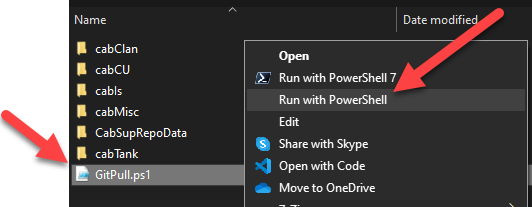

# Git Pull

A script which updates the CAB cache folders, displaying output to the user.
Used to give feedback to the user as to why the CAB update is failing.

# Usage
Download the zip file from the releases.  Extract the GitPull.ps1 to the CaiCache directory.  The CaiCache directory will be in the same folder as the CommunityAssetInstaller.exe .

# Results

If the CAB is currently up to date there should be several lines with the text "Already up to date".  
Otherwise, the out of date files will download.

When completed, re-run the CommunityAssetInstaller.exe to update Battletech's copy of the files.