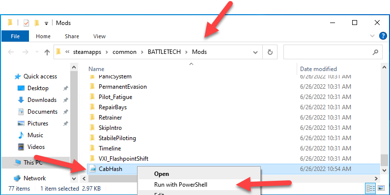
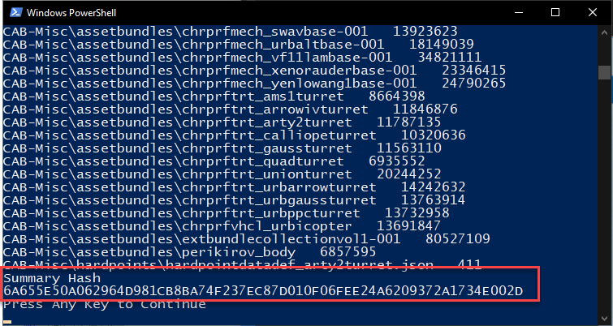
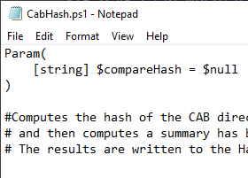

# Cab Hash
A script which helps in diagnosing issues with new Battletech CAB installs.

Running the script will hash all of the files in the CAB directories and return a summary hash as well.  This summary hash can be compared to a known CAB hash that matches the current CAB install.

Additionally the script will also check common errors:
* The script is not being executed in the Mods folder.
* If there are missing CAB folders in the install directory.
* If the Mods folder is in the Battletech directory.
* If the ModTek folder is not in the Mods directory.

# Usage
Copy the CabHash.ps1 from the (TODO: releases link here) to the Battletech\Mods folder.

## Run The script
Right click the script and choose "Run with PowerShell"



The PowerShell will start executing.

When the script completes, a hash string will be shown.  If this hash does not match the hash provided, then the CAB install has failed.



This script will take a while to execute.  It will take at least a minute and can be quite a bit longer for slower systems.

# Click Error
If a Notepad window shows up instead of the PowerShell window pictured above, the the script was double clicked instead of using the "Run with Powershell" context window.  Try again.



# Creating CAB Hashes to Support Users

## Audience 
This section is how to generate a hash for users with install issues to compare against.

## Getting Comparer Hash
The Community Asset Bundle (CAB) is very active and changes frequently.  This means that hashs are valid for a very short time.

The easiest way to get a valid hash for other users to compare to is to create a new directory and have the CAB installer install to that directory.

Copy the script to that install directory and open the directory in a command prompt:

```
powershell -Command .\CabHash.ps1 -ignoreBtFolderChecks $true
```

The -ignoreBtFolderChecks allows the script to be executed in a folder that only has the CAB folders.

# Hash Files
After the script has executed, there will be two files in the directory:  AllHash.txt and Hash.txt.  These files can be compared to the user's files to see exactly which file doesn't match.  There are several tools to compare file differences such as VSCode, WinDiff, etc.


## AllHash.txt
AllHash.txt will contain the summary hash (which is displayed at the end of the script execution).

## Hash.txt
Hash.txt lists every file that was hashed and that file's hash.  

